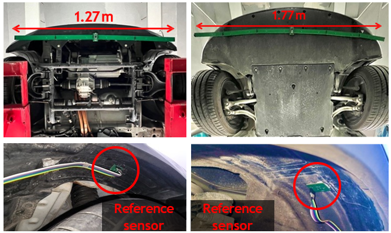
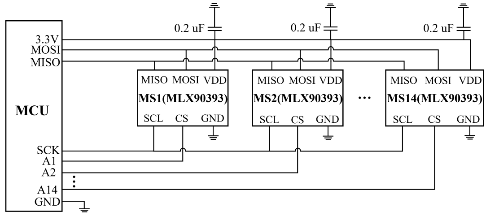

# PCB Design of METRO's Sensor Array

## Description
This directory contains the complete PCB design for METRO's sensor array, including a sensor bar for detecting on-road METRO tags and two reference sensors for eliminating the wheel noise. 

The size of the long sensor bar is 3.2 cm x 177.0 cm.
For better extensibility and mass production, we divide the sensor bar into six segments (i.e., "LeftBar1", "LeftBar2", "LeftBar3", "RightBar1", "RightBar2", "RightBar3").

For each reference sensor (i.e., "Left_Ref_Sensor" and "Right_Ref_Sensor"), the size is 3.2 cm x 3.2 cm.

"MCU" is the PCB design of the Teensy 4.1 Microcontroller Development Board used in METRO. 

"Bom" is the materials and components required to build a sensor array.

## Assembly
Each segment of the long sensor bar is connected with a female and a U-shaped male 2.54mm pin header.
Two 24-pin female headers are welded to the MCU board to connect the Teensy 4.1 Controller Board.

## Curcuit Schematic

## Design Tool and Library
We utilize Altium Designer (version 20.0.13) to design PCB boards.
The component library of capacitive and resistance adopts the standard library.
The footprint of the MLX90393 magnetometer we used, can see https://www.snapeda.com/parts/MLX90393SLW-ABA-011-RE/Melexis%20Technologies/view-part/551380/?ref=search&t=MLX90393

