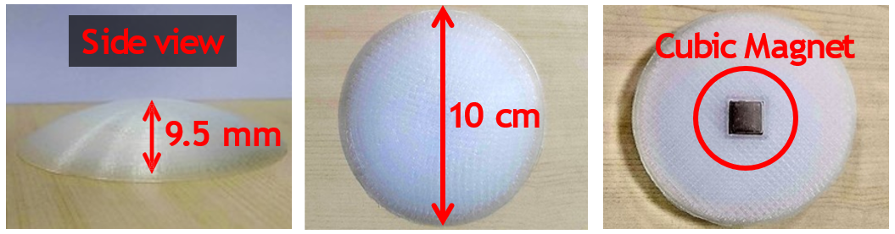

# 3D-printed Protective Shell Design for METRO Tags

## Description
This directory contains 3D-printed protective shell designs for the cubic passive magnet utilized in the METRO system

We provide both STL (stereolithography) and G-code files for your convenience.

- line_tag.stl: The STL file for the protective shell designed for the 90-degree magnet.
- information_tag.stl: the STL file for the protective shell designed for the 0-degree magnet.
- gcode.zip: contains the G-code file for the protective shells designed for both the 90-degree magnet and 0-degree magnet.

## Design tool
We utilize [SolidWorks](https://www.solidworks.com/sw/support/downloads.htm) (version 2021) for designing all the STL files.
To convert these STL files into the G-code format, we use [Ultimaker Cura](https://ultimaker.com/software/ultimaker-cura/) (Version 5.4.0) and our 3D printer is [the Creality Ender-3 S1 Pro](https://www.creality.com/products/creality-ender-3-s1-pro-fdm-3d-printer).
