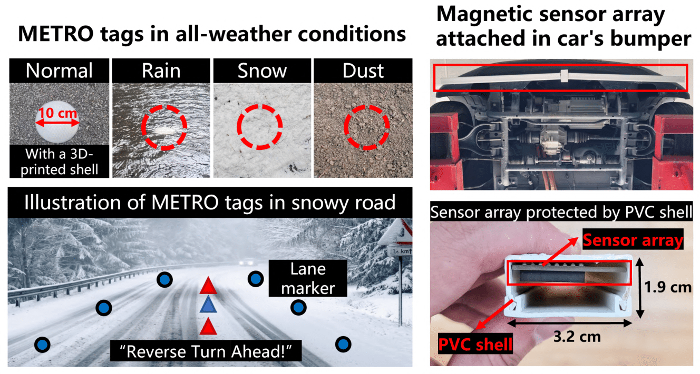
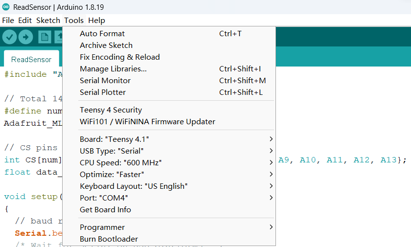
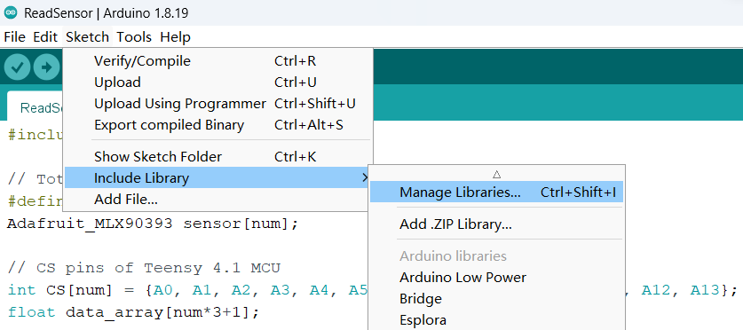
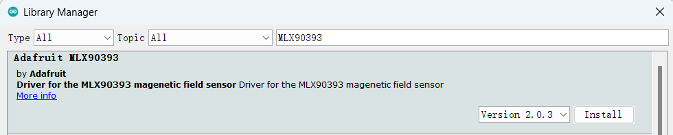

# About
This directory contains all code implementation and hardware designs for METRO.

As a brief summary, road surface markings, like symbols and line markings, are vital
traffic infrastructures for driving safety and efficiency. However,
real-world conditions can impair the utility of existing road markings. For example, adverse weather conditions such as snow and
rain can quickly obliterate visibility.
Existing vision-free methods (e.g., mmWave, RFID) suffer from several key issues, such as
signal distortion due to the multi-path effect in high-speed scenarios
and high deployment costs. 

We propose a novel MagnETic ROad marking system (METRO)
for robust recognition of road markings at low cost and high deployability. METRO pairs (a) easily deployable passive magnetic road
markings with (b) an automotive-grade magnetic sensing framework that detects and interprets these markings. The design of
METRO addresses several real-world challenges, such as mitigating
the impact of magnetic disturbances, lowering deployment costs,
and enhancing the durability of magnetic tags. On-road field tests of
METRO demonstrate an overall accuracy of over 96% in interpreting
various road markings in adverse conditions with less cost (only
$0.17 per meter) than traditional road markings ($0.21-7.70 per meter). Our field evaluation of METRO over one month demonstrates
the practicality and robustness of METRO in real-world settings.





# Lisense
METRO is licensed under the MIT license included in the [LICENSE](./LICENSE) file.

# Setup
To use METRO, the following hardwares and development tools are required:
* [METRO's sensor array](#metros-sensor-array)
* [Arduino IDE](#arduino-ide-setup)
* [Python environment](#python-environment-setup)
* [PCAN-View](#connect-to-the-can-network)

## METRO's sensor array
We provide the manufacturing details of the METRO's sensor array in `/PCBs`, please see the related [README](./PCBs/README.md) file.

## Arduino IDE setup
Arduino IDE is used for programing the sensor array.

1. Download and install [Arduino IDE](https://www.arduino.cc/en/software)
2. Set up the Arduino IDE for the Teensy 4.1 Development Board, according to the [official instruction](https://www.pjrc.com/teensy/td_download.html).
Once completed, you will be able to access the board information by clicking on the 'Tools' menu
  

3. Install the Adafruit MLX90393 Library for the Arduino IDE:
    - Click 'Sketch' --> 'Include Library' --> 'Manage Libraries...'
    
    - Search for Adafruit MLX90393, and install the Adafruit MLX90393 library:
    


## Python environment setup
The METRO system's sensing pipeline is developed using the Python programming language.

1. Install the Python environment. You can install the [official Python distribution](https://www.python.org/downloads/) or [Anaconda](https://www.anaconda.com/download)
2. Install all the dependencies listed in the `./Code/requirements.txt` file by using the command 'pip install \<package-name\>'.


## Connect to the CAN bus
To obtain velocity and steering angle data from the vehicle's Controller Area Network (CAN) bus,
a [PCAN-USB adapter](https://www.peak-system.com/PCAN-USB.199.0.html?&L=1) to connect to the vehicle and the official software [PCAN-View](https://www.peak-system.com/PCAN-View.242.0.html?&L=1) are required.

With these tools, you can connect to the CAN bus with the following Python script.
```python
import can
from can.bus import BusState
from can.interfaces.pcan.basic import *

BUS = can.interface.Bus(bustype="pcan",channel="PCAN_USBBUS1", bitrate=500000)
BUS.state = BusState.PASSIVE
```

Then, you can get the real-time data from the CAN network by running the following code.
```python
msg = BUS.recv(1)
```

The full implementation of obtaining velocity and steering angle data from the CAN network is integrated into the real-time sensing pipeline `Codes/Sensing_Pipeline/real_time_detecting_both_tag.py`. Please see lines 82-101 for more details.


# Run a Quick Demo
You can find a quick demo in the `/Quick_Demo` directory that does not require a connection to the vehicle's CAN network. For more information, please refer to the related [README](./Quick_Demo/README.md) file.


# Citing METRO
If you use METRO in your research or wish to refer to the baseline results, please use the provided BibTeX entry below (TBD).